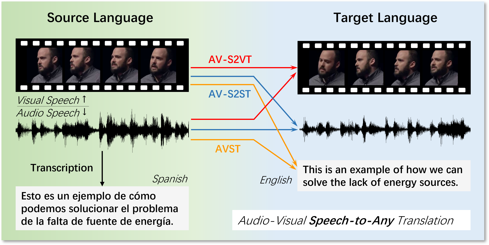

# Mu2PC: A Multilingual Multimodal Parallel Corpus for Audio-Visual Speech-to-Any Translation

## News

We provide link of [Google Drive](https://drive.google.com/file/d/1wzyzwXdaKmJUauMLwaGw82XtwX6Fo6HJ/view?usp=sharing) here for free use. Hope our data is helpful for your reasearch. More audio-visual samples will be updated in a few days.

**Please note that, if you are using Mu2PC, it means that you have accepted the terms of license.**

## Introduction
Automatic Audio-Visual Speech-to-Any Translation is dedicated to generating multimodal translations of text, speech, and talking heads in a target language. We 1) introduce **Mu2PC**, a **Mu**ltilingual **Mu**ltimodal **P**arallel **C**orpus, encompassing parallel data pairs from 4 languages to English across three modalities; 2) propose audio-visual speech-to-vision translation (AV-S2VT) task for the first time, aiming to synthesize translated talking heads; 3) extend the scope of ST and S2ST to AVST and AV-S2ST by incorporating visual speech, thereby creating a comprehensive translation system capable of achieving **Audio-Visual Speech-to-Any Translation**. To facilitate the use and demonstrate the quality of Mu2PC, we conduct four benchmark experiments: audio-visual speech recognition (AVSR), and audio-visual speech translation task groups (AVST, AV-S2ST, and AV-S2VT). Audio-visual samples and the corpus are available at https://Mu2PC.github.io (TODO).



## Dependencies
* [PyTorch](http://pytorch.org/) version >= 1.5.0
* Python version >= 3.6
* **To install fairseq version 1.0.0a0** and develop locally:
``` bash
pip install --editable ./
```

## Download
We provide link of [Google Drive](https://drive.google.com/file/d/1wzyzwXdaKmJUauMLwaGw82XtwX6Fo6HJ/view?usp=sharing) here for free use.

## Data preparation

## License
CC BY-NC-SA 4.0


